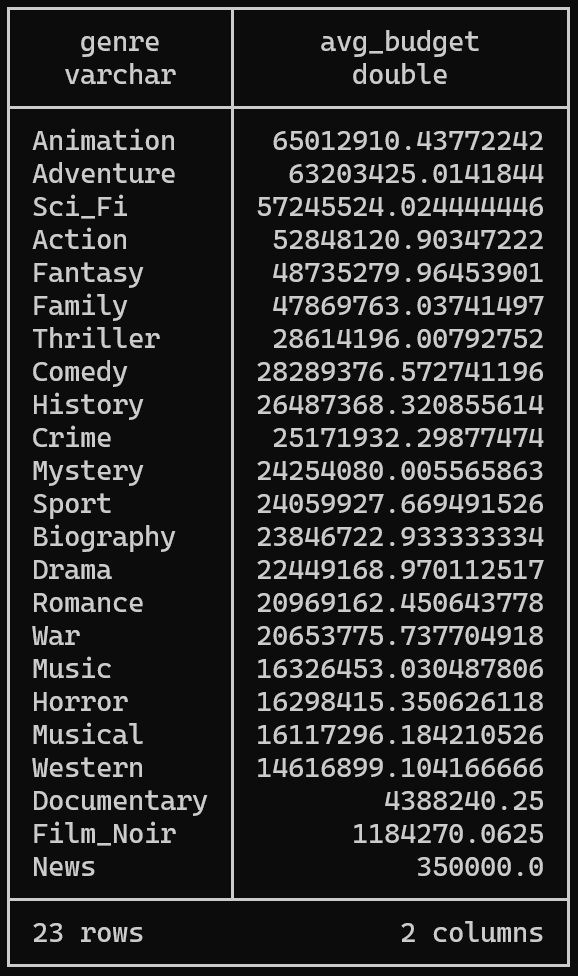
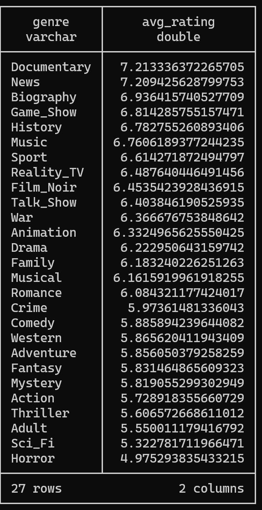

## IMPORT BUDGET DATASETS (TRAIN AND TEST)
```sql
CREATE TABLE budget_train AS
SELECT imdb_id AS tconst, budget
FROM read_csv_auto('C:/Users/sasaa/OneDrive/Documents/GOLANG/src/MyVault/NOTES/UC-Davis/S25/ECS171/project_imdb_rating/Group_of_machine_learning/actors/data/merge_train.csv', delim=',', header=true);
```
```sql
CREATE TABLE budget_test AS
SELECT imdb_id AS tconst, budget
FROM read_csv_auto('C:/Users/sasaa/OneDrive/Documents/GOLANG/src/MyVault/NOTES/UC-Davis/S25/ECS171/project_imdb_rating/Group_of_machine_learning/actors/data/merge_test.csv', delim=',', header=true);
```

## MERGE TRAIN AND TEST BUDGET DATASET
```sql
CREATE TABLE movie_budgets AS
SELECT tconst, budget
FROM budget_train
WHERE budget IS NOT NULL AND budget > 0
UNION
SELECT tconst, budget
FROM budget_test
WHERE budget IS NOT NULL AND budget > 0;
```

## CREATE TABLES AVERAGE BUDEGET PER GENRE
```sql
CREATE TABLE genre_avg_budgets AS
SELECT genre, AVG(budget) AS avg_budget
FROM (
    SELECT m.tconst, 'Action' AS genre, b.budget
    FROM movies_with_genres m
    JOIN movie_budgets b ON m.tconst = b.tconst
    WHERE m.genre_Action = 1
    UNION ALL
    SELECT m.tconst, 'Adult' AS genre, b.budget
    FROM movies_with_genres m
    JOIN movie_budgets b ON m.tconst = b.tconst
    WHERE m.genre_Adult = 1
    UNION ALL
    SELECT m.tconst, 'Adventure' AS genre, b.budget
    FROM movies_with_genres m
    JOIN movie_budgets b ON m.tconst = b.tconst
    WHERE m.genre_Adventure = 1
    UNION ALL
    SELECT m.tconst, 'Animation' AS genre, b.budget
    FROM movies_with_genres m
    JOIN movie_budgets b ON m.tconst = b.tconst
    WHERE m.genre_Animation = 1
    UNION ALL
    SELECT m.tconst, 'Biography' AS genre, b.budget
    FROM movies_with_genres m
    JOIN movie_budgets b ON m.tconst = b.tconst
    WHERE m.genre_Biography = 1
    UNION ALL
    SELECT m.tconst, 'Comedy' AS genre, b.budget
    FROM movies_with_genres m
    JOIN movie_budgets b ON m.tconst = b.tconst
    WHERE m.genre_Comedy = 1
    UNION ALL
    SELECT m.tconst, 'Crime' AS genre, b.budget
    FROM movies_with_genres m
    JOIN movie_budgets b ON m.tconst = b.tconst
    WHERE m.genre_Crime = 1
    UNION ALL
    SELECT m.tconst, 'Documentary' AS genre, b.budget
    FROM movies_with_genres m
    JOIN movie_budgets b ON m.tconst = b.tconst
    WHERE m.genre_Documentary = 1
    UNION ALL
    SELECT m.tconst, 'Drama' AS genre, b.budget
    FROM movies_with_genres m
    JOIN movie_budgets b ON m.tconst = b.tconst
    WHERE m.genre_Drama = 1
    UNION ALL
    SELECT m.tconst, 'Family' AS genre, b.budget
    FROM movies_with_genres m
    JOIN movie_budgets b ON m.tconst = b.tconst
    WHERE m.genre_Family = 1
    UNION ALL
    SELECT m.tconst, 'Fantasy' AS genre, b.budget
    FROM movies_with_genres m
    JOIN movie_budgets b ON m.tconst = b.tconst
    WHERE m.genre_Fantasy = 1
    UNION ALL
    SELECT m.tconst, 'Film_Noir' AS genre, b.budget
    FROM movies_with_genres m
    JOIN movie_budgets b ON m.tconst = b.tconst
    WHERE m.genre_Film_Noir = 1
    UNION ALL
    SELECT m.tconst, 'Game_Show' AS genre, b.budget
    FROM movies_with_genres m
    JOIN movie_budgets b ON m.tconst = b.tconst
    WHERE m.genre_Game_Show = 1
    UNION ALL
    SELECT m.tconst, 'History' AS genre, b.budget
    FROM movies_with_genres m
    JOIN movie_budgets b ON m.tconst = b.tconst
    WHERE m.genre_History = 1
    UNION ALL
    SELECT m.tconst, 'Horror' AS genre, b.budget
    FROM movies_with_genres m
    JOIN movie_budgets b ON m.tconst = b.tconst
    WHERE m.genre_Horror = 1
    UNION ALL
    SELECT m.tconst, 'Music' AS genre, b.budget
    FROM movies_with_genres m
    JOIN movie_budgets b ON m.tconst = b.tconst
    WHERE m.genre_Music = 1
    UNION ALL
    SELECT m.tconst, 'Musical' AS genre, b.budget
    FROM movies_with_genres m
    JOIN movie_budgets b ON m.tconst = b.tconst
    WHERE m.genre_Musical = 1
    UNION ALL
    SELECT m.tconst, 'Mystery' AS genre, b.budget
    FROM movies_with_genres m
    JOIN movie_budgets b ON m.tconst = b.tconst
    WHERE m.genre_Mystery = 1
    UNION ALL
    SELECT m.tconst, 'News' AS genre, b.budget
    FROM movies_with_genres m
    JOIN movie_budgets b ON m.tconst = b.tconst
    WHERE m.genre_News = 1
    UNION ALL
    SELECT m.tconst, 'Reality_TV' AS genre, b.budget
    FROM movies_with_genres m
    JOIN movie_budgets b ON m.tconst = b.tconst
    WHERE m.genre_Reality_TV = 1
    UNION ALL
    SELECT m.tconst, 'Romance' AS genre, b.budget
    FROM movies_with_genres m
    JOIN movie_budgets b ON m.tconst = b.tconst
    WHERE m.genre_Romance = 1
    UNION ALL
    SELECT m.tconst, 'Sci_Fi' AS genre, b.budget
    FROM movies_with_genres m
    JOIN movie_budgets b ON m.tconst = b.tconst
    WHERE m.genre_Sci_Fi = 1
    UNION ALL
    SELECT m.tconst, 'Sport' AS genre, b.budget
    FROM movies_with_genres m
    JOIN movie_budgets b ON m.tconst = b.tconst
    WHERE m.genre_Sport = 1
    UNION ALL
    SELECT m.tconst, 'Talk_Show' AS genre, b.budget
    FROM movies_with_genres m
    JOIN movie_budgets b ON m.tconst = b.tconst
    WHERE m.genre_Talk_Show = 1
    UNION ALL
    SELECT m.tconst, 'Thriller' AS genre, b.budget
    FROM movies_with_genres m
    JOIN movie_budgets b ON m.tconst = b.tconst
    WHERE m.genre_Thriller = 1
    UNION ALL
    SELECT m.tconst, 'War' AS genre, b.budget
    FROM movies_with_genres m
    JOIN movie_budgets b ON m.tconst = b.tconst
    WHERE m.genre_War = 1
    UNION ALL
    SELECT m.tconst, 'Western' AS genre, b.budget
    FROM movies_with_genres m
    JOIN movie_budgets b ON m.tconst = b.tconst
    WHERE m.genre_Western = 1
) genre_budgets
GROUP BY genre
HAVING COUNT(budget) > 0
ORDER BY avg_budget DESC;
```
- movies with budgets 5375
- Average budge per genre
- 

## CREATE TABLE MOVIES WITH BUDGETS
```sql
CREATE TABLE movies_with_budgets AS
SELECT 
    m.tconst, m.primaryTitle, m.startYear, m.averageRating, m.numVotes,
    m.genre_Action, m.genre_Adult, m.genre_Adventure, m.genre_Animation, m.genre_Biography,
    m.genre_Comedy, m.genre_Crime, m.genre_Documentary, m.genre_Drama, m.genre_Family,
    m.genre_Fantasy, m.genre_Film_Noir, m.genre_Game_Show, m.genre_History, m.genre_Horror,
    m.genre_Music, m.genre_Musical, m.genre_Mystery, m.genre_News, m.genre_Reality_TV,
    m.genre_Romance, m.genre_Sci_Fi, m.genre_Sport, m.genre_Talk_Show, m.genre_Thriller,
    m.genre_War, m.genre_Western,
    COALESCE(b.budget, (
        SELECT AVG(gab.avg_budget)
        FROM genre_avg_budgets gab
        JOIN (
            SELECT 'Action' AS genre WHERE m.genre_Action = 1
            UNION ALL SELECT 'Adult' WHERE m.genre_Adult = 1
            UNION ALL SELECT 'Adventure' WHERE m.genre_Adventure = 1
            UNION ALL SELECT 'Animation' WHERE m.genre_Animation = 1
            UNION ALL SELECT 'Biography' WHERE m.genre_Biography = 1
            UNION ALL SELECT 'Comedy' WHERE m.genre_Comedy = 1
            UNION ALL SELECT 'Crime' WHERE m.genre_Crime = 1
            UNION ALL SELECT 'Documentary' WHERE m.genre_Documentary = 1
            UNION ALL SELECT 'Drama' WHERE m.genre_Drama = 1
            UNION ALL SELECT 'Family' WHERE m.genre_Family = 1
            UNION ALL SELECT 'Fantasy' WHERE m.genre_Fantasy = 1
            UNION ALL SELECT 'Film_Noir' WHERE m.genre_Film_Noir = 1
            UNION ALL SELECT 'Game_Show' WHERE m.genre_Game_Show = 1
            UNION ALL SELECT 'History' WHERE m.genre_History = 1
            UNION ALL SELECT 'Horror' WHERE m.genre_Horror = 1
            UNION ALL SELECT 'Music' WHERE m.genre_Music = 1
            UNION ALL SELECT 'Musical' WHERE m.genre_Musical = 1
            UNION ALL SELECT 'Mystery' WHERE m.genre_Mystery = 1
            UNION ALL SELECT 'News' WHERE m.genre_News = 1
            UNION ALL SELECT 'Reality_TV' WHERE m.genre_Reality_TV = 1
            UNION ALL SELECT 'Romance' WHERE m.genre_Romance = 1
            UNION ALL SELECT 'Sci_Fi' WHERE m.genre_Sci_Fi = 1
            UNION ALL SELECT 'Sport' WHERE m.genre_Sport = 1
            UNION ALL SELECT 'Talk_Show' WHERE m.genre_Talk_Show = 1
            UNION ALL SELECT 'Thriller' WHERE m.genre_Thriller = 1
            UNION ALL SELECT 'War' WHERE m.genre_War = 1
            UNION ALL SELECT 'Western' WHERE m.genre_Western = 1
        ) active_genres ON gab.genre = active_genres.genre
    )) AS budget
FROM movies_with_genres m
LEFT JOIN movie_budgets b ON m.tconst = b.tconst;
```

## EXPORT MOVIES WITH BUDGETS
```sql
COPY movies_with_budgets TO 'C:/Users/sasaa/OneDrive/Documents/GOLANG/src/MyVault/NOTES/UC-Davis/S25/ECS171/project_imdb_rating/Group_of_machine_learning/actors/movies_with_budgets.csv' (HEADER, DELIMITER ',');
```

## GENRE AVERAGE MOVIE RATING
```sql
CREATE TABLE genre_avg_ratings AS
SELECT genre, AVG(averageRating) AS avg_rating
FROM (
    SELECT tconst, 'Action' AS genre, averageRating
    FROM movies_with_genres WHERE genre_Action = 1
    UNION ALL
    SELECT tconst, 'Adult' AS genre, averageRating
    FROM movies_with_genres WHERE genre_Adult = 1
    UNION ALL
    SELECT tconst, 'Adventure' AS genre, averageRating
    FROM movies_with_genres WHERE genre_Adventure = 1
    UNION ALL
    SELECT tconst, 'Animation' AS genre, averageRating
    FROM movies_with_genres WHERE genre_Animation = 1
    UNION ALL
    SELECT tconst, 'Biography' AS genre, averageRating
    FROM movies_with_genres WHERE genre_Biography = 1
    UNION ALL
    SELECT tconst, 'Comedy' AS genre, averageRating
    FROM movies_with_genres WHERE genre_Comedy = 1
    UNION ALL
    SELECT tconst, 'Crime' AS genre, averageRating
    FROM movies_with_genres WHERE genre_Crime = 1
    UNION ALL
    SELECT tconst, 'Documentary' AS genre, averageRating
    FROM movies_with_genres WHERE genre_Documentary = 1
    UNION ALL
    SELECT tconst, 'Drama' AS genre, averageRating
    FROM movies_with_genres WHERE genre_Drama = 1
    UNION ALL
    SELECT tconst, 'Family' AS genre, averageRating
    FROM movies_with_genres WHERE genre_Family = 1
    UNION ALL
    SELECT tconst, 'Fantasy' AS genre, averageRating
    FROM movies_with_genres WHERE genre_Fantasy = 1
    UNION ALL
    SELECT tconst, 'Film_Noir' AS genre, averageRating
    FROM movies_with_genres WHERE genre_Film_Noir = 1
    UNION ALL
    SELECT tconst, 'Game_Show' AS genre, averageRating
    FROM movies_with_genres WHERE genre_Game_Show = 1
    UNION ALL
    SELECT tconst, 'History' AS genre, averageRating
    FROM movies_with_genres WHERE genre_History = 1
    UNION ALL
    SELECT tconst, 'Horror' AS genre, averageRating
    FROM movies_with_genres WHERE genre_Horror = 1
    UNION ALL
    SELECT tconst, 'Music' AS genre, averageRating
    FROM movies_with_genres WHERE genre_Music = 1
    UNION ALL
    SELECT tconst, 'Musical' AS genre, averageRating
    FROM movies_with_genres WHERE genre_Musical = 1
    UNION ALL
    SELECT tconst, 'Mystery' AS genre, averageRating
    FROM movies_with_genres WHERE genre_Mystery = 1
    UNION ALL
    SELECT tconst, 'News' AS genre, averageRating
    FROM movies_with_genres WHERE genre_News = 1
    UNION ALL
    SELECT tconst, 'Reality_TV' AS genre, averageRating
    FROM movies_with_genres WHERE genre_Reality_TV = 1
    UNION ALL
    SELECT tconst, 'Romance' AS genre, averageRating
    FROM movies_with_genres WHERE genre_Romance = 1
    UNION ALL
    SELECT tconst, 'Sci_Fi' AS genre, averageRating
    FROM movies_with_genres WHERE genre_Sci_Fi = 1
    UNION ALL
    SELECT tconst, 'Sport' AS genre, averageRating
    FROM movies_with_genres WHERE genre_Sport = 1
    UNION ALL
    SELECT tconst, 'Talk_Show' AS genre, averageRating
    FROM movies_with_genres WHERE genre_Talk_Show = 1
    UNION ALL
    SELECT tconst, 'Thriller' AS genre, averageRating
    FROM movies_with_genres WHERE genre_Thriller = 1
    UNION ALL
    SELECT tconst, 'War' AS genre, averageRating
    FROM movies_with_genres WHERE genre_War = 1
    UNION ALL
    SELECT tconst, 'Western' AS genre, averageRating
    FROM movies_with_genres WHERE genre_Western = 1
) genre_ratings
GROUP BY genre
ORDER BY avg_rating DESC; 
```
- 

## MOVIES WITH GENRE SCORE
```sql
CREATE TABLE movies_with_genre_score AS
SELECT 
    m.tconst, m.primaryTitle, m.startYear, m.averageRating, m.numVotes,
    (SELECT AVG(gar.avg_rating)
     FROM genre_avg_ratings gar
     JOIN (
         SELECT 'Action' AS genre WHERE m.genre_Action = 1
         UNION ALL SELECT 'Adult' WHERE m.genre_Adult = 1
         UNION ALL SELECT 'Adventure' WHERE m.genre_Adventure = 1
         UNION ALL SELECT 'Animation' WHERE m.genre_Animation = 1
         UNION ALL SELECT 'Biography' WHERE m.genre_Biography = 1
         UNION ALL SELECT 'Comedy' WHERE m.genre_Comedy = 1
         UNION ALL SELECT 'Crime' WHERE m.genre_Crime = 1
         UNION ALL SELECT 'Documentary' WHERE m.genre_Documentary = 1
         UNION ALL SELECT 'Drama' WHERE m.genre_Drama = 1
         UNION ALL SELECT 'Family' WHERE m.genre_Family = 1
         UNION ALL SELECT 'Fantasy' WHERE m.genre_Fantasy = 1
         UNION ALL SELECT 'Film_Noir' WHERE m.genre_Film_Noir = 1
         UNION ALL SELECT 'Game_Show' WHERE m.genre_Game_Show = 1
         UNION ALL SELECT 'History' WHERE m.genre_History = 1
         UNION ALL SELECT 'Horror' WHERE m.genre_Horror = 1
         UNION ALL SELECT 'Music' WHERE m.genre_Music = 1
         UNION ALL SELECT 'Musical' WHERE m.genre_Musical = 1
         UNION ALL SELECT 'Mystery' WHERE m.genre_Mystery = 1
         UNION ALL SELECT 'News' WHERE m.genre_News = 1
         UNION ALL SELECT 'Reality_TV' WHERE m.genre_Reality_TV = 1
         UNION ALL SELECT 'Romance' WHERE m.genre_Romance = 1
         UNION ALL SELECT 'Sci_Fi' WHERE m.genre_Sci_Fi = 1
         UNION ALL SELECT 'Sport' WHERE m.genre_Sport = 1
         UNION ALL SELECT 'Talk_Show' WHERE m.genre_Talk_Show = 1
         UNION ALL SELECT 'Thriller' WHERE m.genre_Thriller = 1
         UNION ALL SELECT 'War' WHERE m.genre_War = 1
         UNION ALL SELECT 'Western' WHERE m.genre_Western = 1
     ) active_genres ON gar.genre = active_genres.genre
    ) AS genre_score
FROM movies_with_genres m; 
```

## EXPORT MOVIES WITH GENRE SCORE
```sql
COPY movies_with_genre_score TO 'C:/Users/sasaa/OneDrive/Documents/GOLANG/src/MyVault/NOTES/UC-Davis/S25/ECS171/project_imdb_rating/Group_of_machine_learning/actors/movies_with_genre_score.csv' (HEADER, DELIMITER ','); 
```