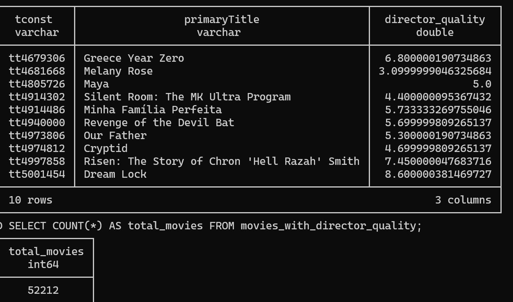

- Average directors per movie 1.2345

## CREATE TABLE WITH MOVIE DIRECTOR PAIRS
```sql
CREATE TABLE movie_directors_temp AS
SELECT tconst, director_id
FROM (
    SELECT m.tconst, 
           split_part(tc.directors, ',', 1) AS director_id,
           1 AS director_rank
    FROM recent_movies m
    JOIN title_crew tc ON m.tconst = tc.tconst
    WHERE tc.directors IS NOT NULL AND tc.directors != '\N'
      AND split_part(tc.directors, ',', 1) != ''
    UNION ALL
    SELECT m.tconst, 
           split_part(tc.directors, ',', 2) AS director_id,
           2 AS director_rank
    FROM recent_movies m
    JOIN title_crew tc ON m.tconst = tc.tconst
    WHERE tc.directors IS NOT NULL AND tc.directors != '\N'
      AND split_part(tc.directors, ',', 2) != ''
    UNION ALL
    SELECT m.tconst, 
           split_part(tc.directors, ',', 3) AS director_id,
           3 AS director_rank
    FROM recent_movies m
    JOIN title_crew tc ON m.tconst = tc.tconst
    WHERE tc.directors IS NOT NULL AND tc.directors != '\N'
      AND split_part(tc.directors, ',', 3) != ''
) md
WHERE director_id IS NOT NULL
ORDER BY tconst, director_rank;
```

## CRETEA TABLE WITH DIRECTOR DATA
```sql
CREATE TABLE director_scores_temp AS
SELECT 
    md.director_id,
    COUNT(DISTINCT md.tconst) AS director_experience,
    AVG(rm.averageRating) AS director_quality,
    SUM(rm.numVotes) AS director_total_votes
FROM movie_directors_temp md
JOIN recent_movies rm ON md.tconst = rm.tconst
GROUP BY md.director_id
HAVING COUNT(DISTINCT md.tconst) >= 1;
```
- Director count 44361

## PREPARE DATASET FOR LINEAR REGRESSION (NOT USED)
```sql
CREATE TABLE director_regression_data AS
SELECT 
    md.tconst,
    md.director_id,
    rm.averageRating AS target_rating,
    ds.director_experience,
    ds.director_quality,
    ds.director_total_votes
FROM movie_directors_temp md
JOIN director_scores_temp ds ON md.director_id = ds.director_id
JOIN recent_movies rm ON md.tconst = rm.tconst;
```
- count - 59336
- export for ridge regression
```sql
COPY director_regression_data TO 'C:/Users/sasaa/OneDrive/Documents/GOLANG/src/MyVault/NOTES/UC-Davis/S25/ECS171/project_imdb_rating/Group_of_machine_learning/actors/director_regression_data.csv' (HEADER, DELIMITER ','); 
```
- Initial version (3 feature)
 director_experience: -0.0009
director_quality: 1.4869
director_total_votes: -0.0012
R^2 score: 0.8699
 MSE: 0.3370
Test set RMSE: 0.5806

- reduced version
director_experience: 1.4870
R^2 score: 0.8699
 MSE: 0.3370
Test set RMSE: 0.5805

## CREATE MOVIES WITH DIRECTOR QUALITY
```sql
CREATE TABLE movies_with_director_quality AS
SELECT 
    m.tconst, m.primaryTitle, m.startYear, m.averageRating, m.numVotes,
    AVG(ds.director_quality) AS director_quality
FROM recent_movies m
INNER JOIN movie_directors_temp md ON m.tconst = md.tconst
INNER JOIN director_scores_temp ds ON md.director_id = ds.director_id
GROUP BY m.tconst, m.primaryTitle, m.startYear, m.averageRating, m.numVotes;
```
- 

## EXPORT DIRECTOR SCORES FOR FLASK
```sql
COPY director_scores_temp TO 'C:/Users/sasaa/OneDrive/Documents/GOLANG/src/MyVault/NOTES/UC-Davis/S25/ECS171/project_imdb_rating/Group_of_machine_learning/actors/director_quality.csv' (HEADER, DELIMITER ','); 
```